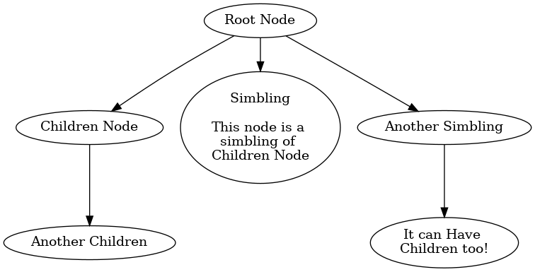
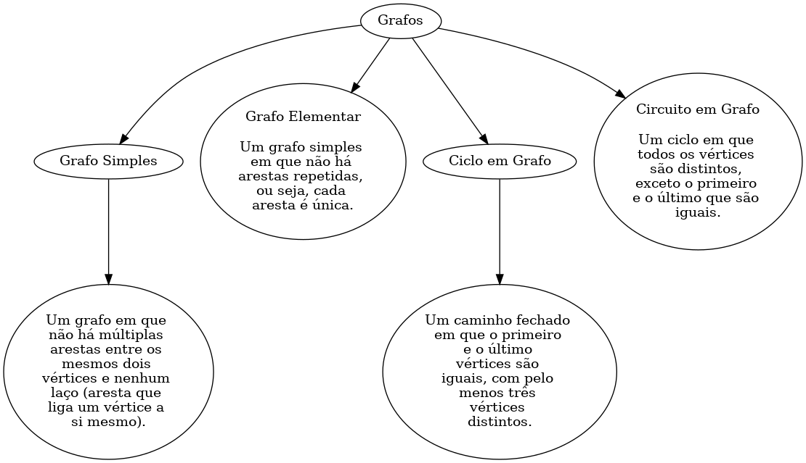

# JSON2Tree

JSON 2 Tree CLI tool for creating Graph images from JSON files

## Running the project

⚠️ Important: download Graphviz

On Linux:

```shell
sudo apt-get install graphviz
```

On Windows: https://www.graphviz.org/download/

install dependencies:

```shell
# install dependencies
yarn install
```

Once you have a valid JSON file, you can run the CLI
like this:

```shell
# linux
json2tree-linux -i my-json-file.json -o output-graph.png
# or
# json2tree-linux --input my-json-file.json --output output-graph.png

# windows
.\json2tree-win.exe -i my-json-file.json -o output-graph.png
# or
# .\json2tree-win.exe --input my-json-file.json --output output-graph.png
```


## A Valid JSON

This is a basic building block of a node that json2tree can interpret:

```json
{
    "name": "Name of the node",
    "description": "Optional description of the node",
    "children": []
}
```

And we can build way more complex structures, as follows:

```json
{
    "name": "Root Node",
    "children": [
        {
            "name": "Children Node",
            "children": [
                {
                    "name": "Another Children"
                }
            ]
        },
        {
            "name": "Simbling",
            "description": "This node is a simbling of Children Node",
            "children": []
        },
        {
            "name": "Another Simbling",
            "children": [
                {
                    "name": "It can Have Children too!"
                }
            ]
        }
    ]
}
```




### Building

You can build your own executable by using the `pkg` library, like this:

```shell
npx pkg --output builds/json2tree --targets node14-win-x64,node14-macos-x64,node14-linux-x64 json2tree.js
```
